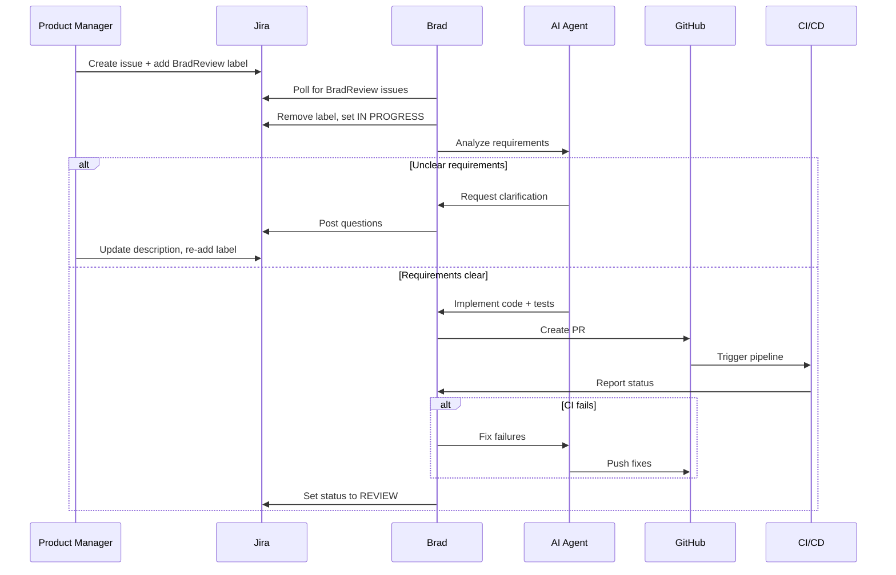

# Brad - Autonomous AI Software Engineer

[](https://github.com/ai-brad/brad/actions)
[](https://github.com/ai-brad/brad)
[](LICENSE)
[](https://www.python.org/downloads/)

> **Your autonomous software engineer that takes Jira tickets and delivers production-ready code**

Brad is an autonomous AI software engineer that takes JIRA issues labeled with `BradReview`, implements them using an LLM-powered coding agent, and delivers production-ready code via pull requests.

## 🎥 Demo

**Watch Brad in action:** [Video Demo](https://github.com/ai-brad/brad/raw/main/docs/brad.mp4)


## ✨ Key Features

- 🤖 **Fully Autonomous** - Takes Jira tickets from requirements to merged PR
- 🔍 **Requirements Analysis** - Detects ambiguities and asks clarifying questions
- 🧪 **Test-Driven** - Writes and runs tests for all changes
- 🔄 **CI/CD Integration** - Monitors pipelines and fixes failures automatically
- 💬 **Code Review** - Addresses review comments autonomously
- 💰 **Cost Tracking** - Tracks LLM usage and cost per ticket
- 🎯 **Safety First** - Configurable iteration limits and human approval gates
- 🔌 **Extensible** - Adapter pattern for easy integration swaps

## 🏗️ Architecture

Brad is a **thin orchestration layer** that delegates all engineering decisions to an AI coding agent. Brad uses an **adapter pattern** to abstract all external integrations, making it straightforward to swap ticketing systems, code repositories, CI/CD providers, observability tools, and LLM backends.

### Adapter Pattern

| Layer | Abstract Interface | Current Implementation |
|---|---|---|
| **Ticketing** | `TicketingAdapter` | Jira |
| **Code Repository** | `CodeRepositoryAdapter` | GitHub |
| **CI/CD** | `CICDAdapter` | GitHub Actions |
| **Observability** | `ObservabilityAdapter` | Azure AKS |
| **Agent harness** | `AgentHarness` | Brad's tool-calling loop, OpenAI Codex CLI |
| **LLM provider** *(used by `BradHarness`)* | `LLMProvider` | Azure OpenAI Responses API |

### 📁 Project Structure

```
brad.py                          # CLI entry point
brad_gui.py                      # Web GUI entry point
brad/                            # Main package
├── orchestrator.py              # Core workflow engine
├── config.py                    # Configuration management
├── db.py                        # SQLite persistence (history, costs)
├── logging_config.py
├── repo_manager.py              # Git operations (standalone)
├── adapters/                    # Adapter layer
│   ├── ticketing/               # e.g. Jira
│   ├── code_repository/         # e.g. GitHub
│   ├── ci_cd/                   # e.g. GitHub Actions
│   ├── observability/           # e.g. Azure AKS
│   ├── harness/                 # Agent harnesses (BradHarness, CodexCliHarness)
│   └── llm/                     # LLM providers used by BradHarness (Azure OpenAI)
├── agents/                      # Prompt building & response parsing
│   └── interface.py
└── gui/                         # Flask read-only dashboard
    ├── app.py
    ├── static/
    └── templates/
tests/                           # Unit tests
```

## 📋 Prerequisites

1. **Python 3.12+**
2. **uv**
3. **Azure OpenAI** resource with a deployed model
4. **Git**
5. **JIRA Account** with API access
6. **GitHub Account** with API access
7. **Target Repository** — the repository Brad will work on

## 🚀 Installation

### Step 1: Install uv

**macOS/Linux:**
```bash
curl -LsSf https://astral.sh/uv/install.sh | sh
```

**Windows:**
```powershell
irm https://astral.sh/uv/install.ps1 | iex
```

### Step 2: Clone and Install

```bash
git clone https://github.com/ai-brad/brad.git
cd brad
uv sync
```

### Step 3: Verify Installation

```bash
uv run python brad.py --help
```

## ⚙️ Configuration

1. Copy the example configuration:
```bash
cp .env.example .env
```

2. Edit `.env` and fill in your credentials:

**Required Settings:**
- **Jira**: `JIRA_URL`, `JIRA_USER`, `JIRA_TOKEN` - [Get Jira API token](https://id.atlassian.com/manage-profile/security/api-tokens)
- **GitHub**: `GITHUB_REPO` plus either:
  - `GITHUB_TOKEN` - classic PAT / fine-grained token with repo access
  - `GITHUB_APP_ID`, `GITHUB_APP_INSTALLATION_ID`, and `GITHUB_APP_PRIVATE_KEY` or `GITHUB_APP_PRIVATE_KEY_PATH` - preferred for long-lived bot auth
- **Repository**: `TARGET_REPO_PATH` *(optional)* - Absolute path to an existing local clone of `GITHUB_REPO`. If unset, Brad self-bootstraps a clone under `BRAD_WORKSPACE_DIR` (default `~/.brad/workspaces`) using HTTPS and the configured GitHub auth mode.
- **Azure OpenAI**: `AZURE_OPENAI_ENDPOINT`, `AZURE_OPENAI_API_KEY`, `AZURE_OPENAI_MODEL` - [Azure OpenAI setup](https://learn.microsoft.com/en-us/azure/ai-services/openai/quickstart)

**Optional Settings:**
- **Cost Tracking**: `LLM_COST_PER_1K_PROMPT_TOKENS`, `LLM_COST_PER_1K_COMPLETION_TOKENS`
- **Safety Limits**: `MAX_CI_FIX_ITERATIONS`, `MAX_REVIEW_FIX_ITERATIONS`
- **Azure AKS**: For deployment monitoring (can be left empty)

See `.env.example` for detailed instructions on each setting.

### Provisioning the target repo's environment

The target repo (the one Brad writes code in) almost certainly has its own `.env` file — database credentials, API keys, feature flags — that is not version-controlled. Brad clones that repo automatically, but it has no way to know where those secrets live on your server. You must tell it via a **provision hook**.

Set `TARGET_REPO_PROVISION_HOOK` in Brad's `.env` to the path of an executable shell script. Brad runs it once immediately after cloning the target repo, passing the clone path as `$1`:

```bash
# ~/.brad/hooks/provision-target.sh  — lives on the server, never committed
#!/bin/bash
set -euo pipefail
TARGET_PATH="$1"
cp ~/.brad/secrets/my-project.env "$TARGET_PATH/.env"
# Start services the test suite needs, e.g.:
# docker compose -f "$TARGET_PATH/docker-compose.yml" up -d
```

```bash
chmod 700 ~/.brad/hooks/provision-target.sh
# In brad's .env:
TARGET_REPO_PROVISION_HOOK=/home/you/.brad/hooks/provision-target.sh
```

Keep `~/.brad/secrets/` (or wherever you store the secrets file) outside of any git repository. The hook itself must also never be committed. If the hook exits non-zero, Brad logs the error but does not abort — an already-provisioned workspace still works.

## 📖 Usage

### Run Brad Once

```bash
uv run python brad.py run --once
```

### Start Web Dashboard

```bash
uv run python brad_gui.py
```

Open your browser to `http://localhost:5000`

The dashboard shows:
- ✅ Execution history with status
- 💰 Per-ticket cost breakdowns
- 🔄 Real-time CI/CD status
- 📊 PR details with reviews and checks
- 📈 Token usage and cost trends

### Debug Logging

```bash
uv run python brad.py run --once --log-level DEBUG
```

## 🔄 How It Works



**Step-by-step:**

1. **PM creates JIRA issue** with description + attachments, adds label `BradReview`
2. **Brad analyzes requirements** — may request clarification or propose test scenarios
3. **Brad implements** — creates feature branch, writes code + tests, opens PR
4. **Brad monitors CI/CD** — fixes failures (up to 5 attempts), addresses review comments
5. **Brad completes** — sets JIRA status to REVIEW, posts "Brad is done."

## 🛡️ Safety Features

- **Max clarification cycles:** 3 per issue
- **Max CI fix iterations:** 5 per issue
- **Max review fix iterations:** 3 per issue
- **Agent iteration limit:** 200 per LLM invocation
- **No scope changes** — Brad never modifies requirements
- **No auto-merge** — all PRs require human review

## 🧪 Testing

Install test dependencies with:
```bash
uv sync --extra test
```

Run the test suite with:
```bash
# Run all tests
uv run pytest tests/ -v

# Run with coverage report
uv sync --extra test
uv run pytest tests/ --cov=brad --cov-report=html

# View coverage report
open htmlcov/index.html  # macOS
start htmlcov/index.html  # Windows
```

## 🔧 Troubleshooting

### Brad won't start

**Error: "Configuration validation failed"**
- Check that `TARGET_REPO_PATH` points to a valid git repository
- Ensure all required environment variables are set in `.env`
- Run `uv run python brad.py run --once --log-level DEBUG` for detailed logs

**Error: "No module named 'brad'"**
- Run `uv sync` to install dependencies
- Make sure you're in the brad directory

### Brad can't access Jira/GitHub

**Error: "Unauthorized" or "401"**
- Verify your API tokens are correct
- Check token permissions (GitHub needs `repo` + `workflow`, Jira needs read/write)
- Ensure tokens haven't expired

**Error: "Resource not found" or "404"**
- Double-check `JIRA_URL` format (should include https://)
- Verify `GITHUB_REPO` is in `owner/repo` format
- Ensure `JIRA_PROJECT_KEY` matches your project

### Brad creates PR but CI never runs

- Check that GitHub Actions are enabled in your repository
- Verify the target repo has CI workflows configured
- Look at the PR on GitHub - are there CI checks showing?

### High LLM costs

- Consider using a cheaper model (gpt-4o-mini instead of gpt-4o)
- Reduce `MAX_CI_FIX_ITERATIONS` and `MAX_REVIEW_FIX_ITERATIONS`
- Set `COST_BUDGET` to enforce spending limits
- Check cost tracking in the dashboard

### Brad gets stuck on an issue

- Check logs in `logs/` directory for errors
- Look at the Jira issue - did Brad post a comment explaining why?
- Brad posts "Brad is stuck" when hitting iteration limits
- Remove the issue from IN PROGRESS and re-add `BradReview` to retry

### GUI doesn't show data

- Make sure `brad_data.db` exists (run Brad at least once)
- Check that `brad_gui.py` is using the same `BRAD_DB_PATH` as `brad.py`
- Look for errors in the terminal where you started the GUI

## ❓ FAQ

**Q: Can Brad work on any programming language?**  
A: Yes! Brad uses an LLM agent that understands most programming languages. The language-specific behavior comes from the AI model, not from Brad's orchestration.

**Q: How much does it cost to run Brad?**  
A: Cost depends on your Azure OpenAI pricing. Typical cost per issue:
- Simple bug fix: $0.10 - $0.50
- Medium feature: $0.50 - $2.00
- Complex feature: $2.00 - $5.00

**Q: Does Brad merge PRs automatically?**  
A: No. Brad creates PRs and marks them as ready for review, but a human must merge. This is a safety feature.

**Q: Can I use OpenAI directly instead of Azure?**  
A: Two routes:
1. Set `BRAD_HARNESS=codex` to delegate the entire agentic loop to OpenAI's [Codex CLI](https://github.com/openai/codex) — it brings its own model auth (`codex login` / `OPENAI_API_KEY`).
2. For Brad's native harness, only Azure OpenAI is wired today; adding an `OpenAIProvider` (or vLLM, etc.) is a small file under `brad/adapters/llm/`.

Anthropic Claude Code is not currently supported.

**Q: What happens if Brad makes a mistake?**  
A: Brad's changes go through normal PR review. You can request changes, and Brad will attempt to address them. If Brad can't fix the issue, it will mark itself as stuck.

**Q: Can I run multiple Brad instances?**  
A: Yes, but each instance should work on different Jira projects or use different labels to avoid conflicts.

**Q: How do I add support for GitLab instead of GitHub?**  
A: See [CONTRIBUTING.md](CONTRIBUTING.md) for how to create a new code repository adapter.

**Q: Is Brad production-ready?**  
A: Brad is being used in production environments but is still actively developed. Pin your version and test thoroughly before production deployment.

## 🤝 Contributing

See [CONTRIBUTING.md](CONTRIBUTING.md) for how to add new adapters and extend Brad.

## 📄 License

[MIT](LICENSE)

## 🙏 Acknowledgments

Brad is built on:
- [Azure OpenAI](https://azure.microsoft.com/en-us/products/ai-services/openai-service) for LLM capabilities
- [uv](https://github.com/astral-sh/uv) for fast Python package management
- [Flask](https://flask.palletsprojects.com/) for the web dashboard

## 📞 Support

- 📖 [Documentation](README.md)
- 🐛 [Issue Tracker](https://github.com/ai-brad/brad/issues)
- 💬 [Discussions](https://github.com/ai-brad/brad/discussions)
- 📧 Email: support@brad-project.dev (coming soon)
